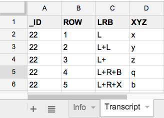

# valid-records

A simple module and CLI (`validate-ndj`) for validation reporting on specified fields within a set of records.

Sample records:

```javascript
{ row: 1, X: 'x1', Y: 'y1', Z: 'z1' }
{ row: 2, X: 'x2', Y: 'y2', Z: 'z2' }
{ row: 3, X: 'x3', Y: 'y3', Z: 'z3' }
{ row: 4, X: 'OH NOES!', Y: 'y4', Z: 'z4' }
```

A simple schema containing one validation constraint for field **X**:

```javascript
var schema = {

    X: function (value) {
        column = 'X';
        if (value) {
            if (!/^x\d*$/.test(value)) {
                return value + ' is an invalid value for X';
            }
        }
    }
}
```

The CLI is designed to validate newline-delimited JSON (e.g., [`records.ndj`](records.ndj)) from [**stdout**](http://en.wikipedia.org/wiki/Standard_streams).  You just pass 
in a file containing your validation schema (e.g., [`rec.schema.js`](rec.schema.js):

    cat records.ndj | valid-records --schema=rec.schema.js


## Usage

    npm install -g valid-records
    npm run test
    npm run demo
    npm run cli-demo


## CLI example

Suppose we have an excel file (`sample.xlsx`) ...



We can convert the displayed worksheet (named **Transcript**) to newline-delimited JSON with [`parse-xl`](https://github.com/joyrexus/parse-xl):

    parse-xl --sheet=Transcript sample.xlsx 

This outputs ...

```json
{ "_ID": "22", "ROW": "1", "LRB": "L",     "XYZ": "x" }
{ "_ID": "22", "ROW": "2", "LRB": "L+L",   "XYZ": "y" }
{ "_ID": "22", "ROW": "3", "LRB": "L+ ",   "XYZ": "z" }
{ "_ID": "22", "ROW": "4", "LRB": "L+R+B", "XYZ": "q" }
{ "_ID": "22", "ROW": "5", "LRB": "L+R+X", "XYZ": "b" }
```

We can pipe these records to `valid-records` and check to see if any records fail to meet our specified field constraints ([`rec.schema.js`](rec.schema.js)):

    parse-xl --sheet=Transcript sample.xlsx | \
        valid-records --schema=rec.schema.js

This outputs ...

```json
{ "index": 2, "errors": [ "LRB = `L+ ` is an invalid value"] }
{ "index": 3, "errors": [ "XYZ = `q` is an invalid value"] }
{ "index": 4, "errors": [ "LRB = `L+R+X` is an invalid value", "XYZ = `b` is an invalid value" ] }
```


## See Also

* [`parse-xl`](https://github.com/joyrexus/parse-xl) - parse excel worksheets with column headers
* [`valid-xl`](https://github.com/joyrexus/valid-xl) - validate values in columns of an excel worksheet
